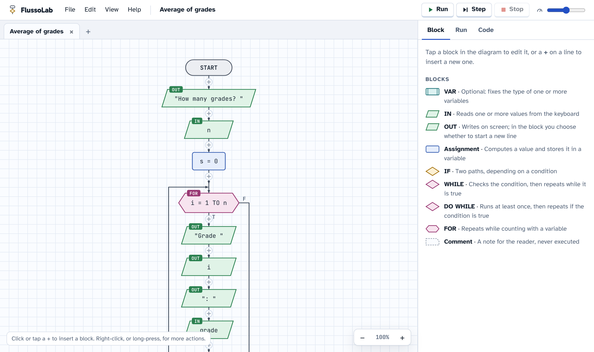
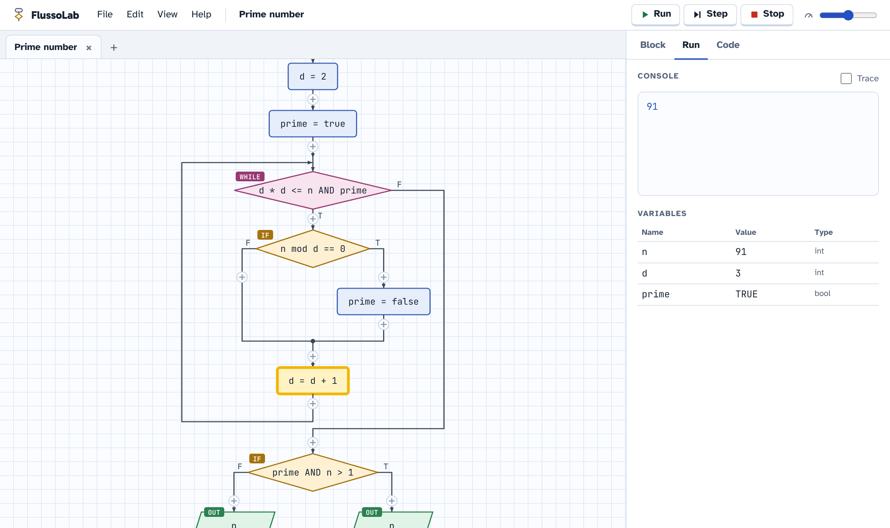
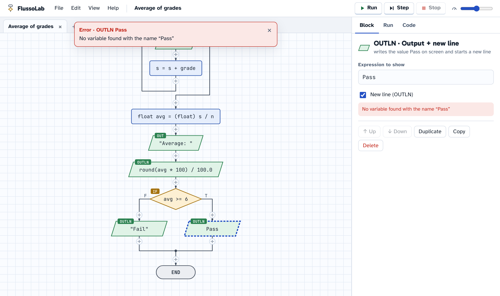
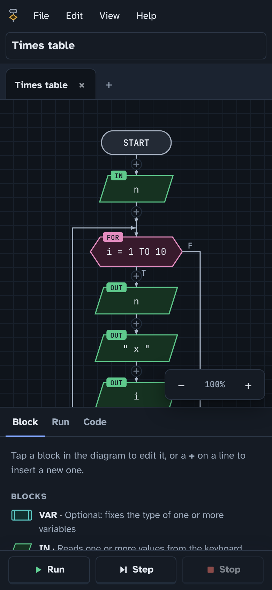

# FlussoLab

[Italiano](README.it.md) · **English**

A flowchart editor that runs in the browser, made for school.
Nothing to install: it works on PC, Mac, Chromebook and tablets.

**[Open FlussoLab](https://flussolab.s3l.it/)**

## What it does

- Blocks `IN`, `OUT`, `OUTLN`, assignment, `IF`, `WHILE`, `DO WHILE`, `FOR`, `VAR` and comment
- Types like in C (`int`, `float`, `string`, `bool`), automatic or declared
- Run the whole program or step by step, with the variables
- Errors explained in plain words
- Pseudocode and Python code generated automatically
- Several diagrams open in tabs, `.flusso` files, PNG export and a single ZIP to hand in
- Italian and English (more languages welcome), light and dark theme

## How it looks

**Step-by-step run**: the current block is highlighted and the variables are shown on the right.

**Clear errors**: the wrong block is marked before running, with a message that explains what to fix.

**On phones and tablets too**, with the dark theme.

## Install it as an app

FlussoLab can be installed and also works without internet:

- **Chrome or Edge** (Windows, Chromebook, Android): browser menu → “Install FlussoLab”.
- **iPhone and iPad**: Safari → Share → “Add to Home Screen”.

## Contributing

Reports and ideas are welcome: read [CONTRIBUTING.md](CONTRIBUTING.md).
Want FlussoLab in your language? Just add one file to the [`lang/`](lang) folder: the steps are in CONTRIBUTING.md.

## Author

Developed and maintained by [aSamu3l](https://github.com/aSamu3l).

## License

[CC BY-NC-SA 4.0](LICENSE): free and open to everyone, commercial use is not allowed.
Modified versions must credit the author, stay public under the same license
and use a name other than "FlussoLab".
