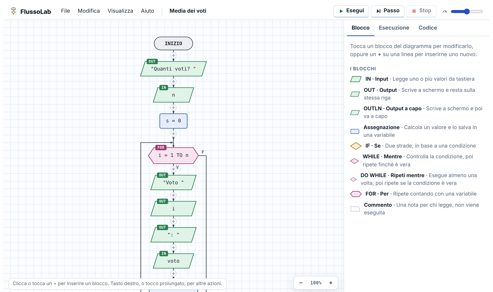
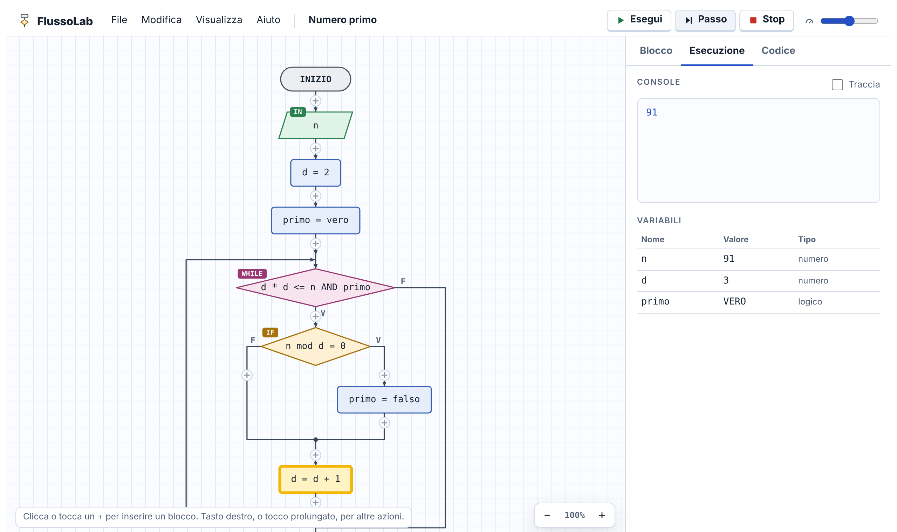
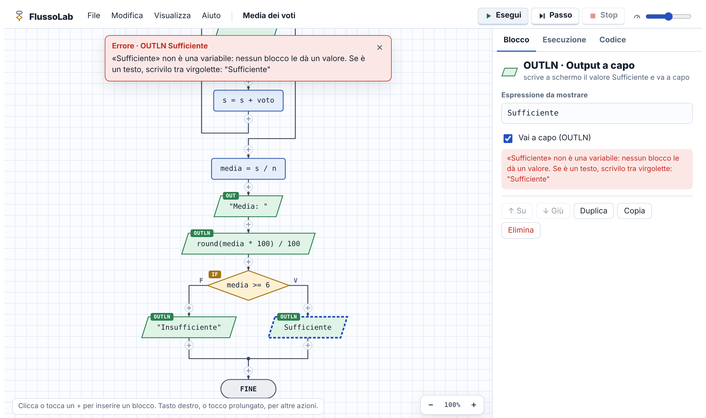
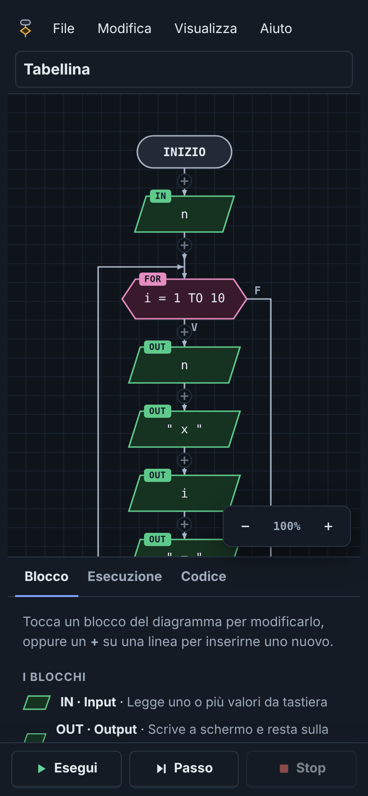

# FlussoLab

Editor di diagrammi di flusso che funziona nel browser, pensato per la scuola.
Niente da installare: va su PC, Mac, Chromebook e tablet.

**[Apri FlussoLab](https://asamu3l.github.io/FlussoLab/)**

## Cosa fa

- Blocchi `IN`, `OUT`, `OUTLN`, assegnazione, `IF`, `WHILE`, `DO WHILE`, `FOR` e commento
- Esecuzione completa o passo passo, con le variabili
- Errori spiegati in modo semplice
- Pseudocodice generato in automatico
- Salvataggio in file `.flusso` ed esportazione in PNG
- Italiano e inglese, tema chiaro e scuro

## Come si presenta

**Esecuzione passo passo**: il blocco attivo è evidenziato e a destra si vedono le variabili.

**Errori chiari**: il blocco sbagliato viene segnalato prima di eseguire, con un messaggio che spiega cosa correggere.

**Anche su telefono e tablet**, con il tema scuro.

## Installare come app

FlussoLab si può installare e funziona anche senza internet:

- **Chrome o Edge** (Windows, Chromebook, Android): menu del browser → «Installa FlussoLab».
- **iPhone e iPad**: Safari → Condividi → «Aggiungi alla schermata Home».

## Contribuire

Segnalazioni e proposte sono benvenute: leggi [CONTRIBUTING.md](CONTRIBUTING.md).

## Autore

Sviluppato e mantenuto da [aSamu3l](https://github.com/aSamu3l).

## Licenza

[CC BY-NC-SA 4.0](LICENSE): gratuito e aperto a tutti, vietato l'uso commerciale.
Le versioni modificate devono citare l'autore, restare pubbliche con la stessa licenza
e usare un nome diverso da "FlussoLab".
